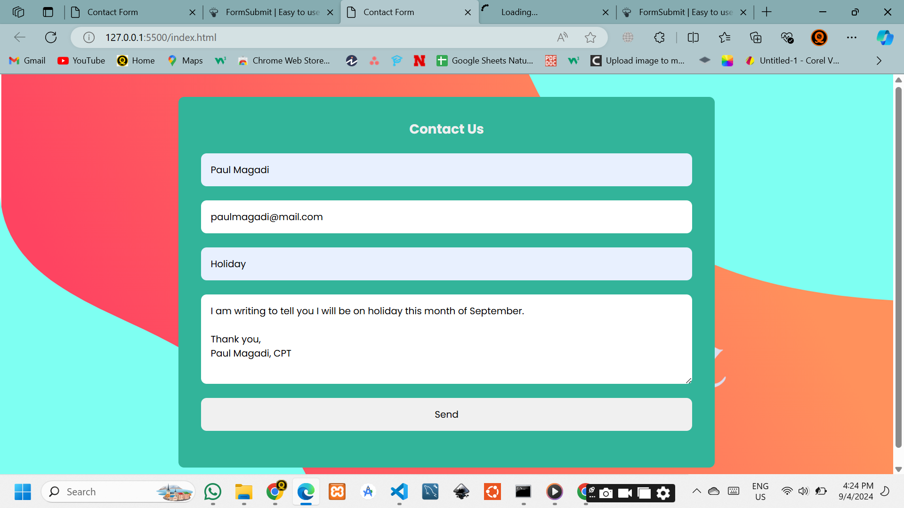
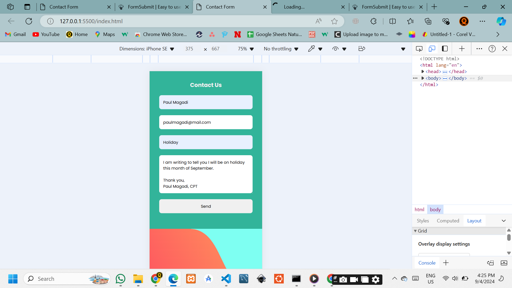
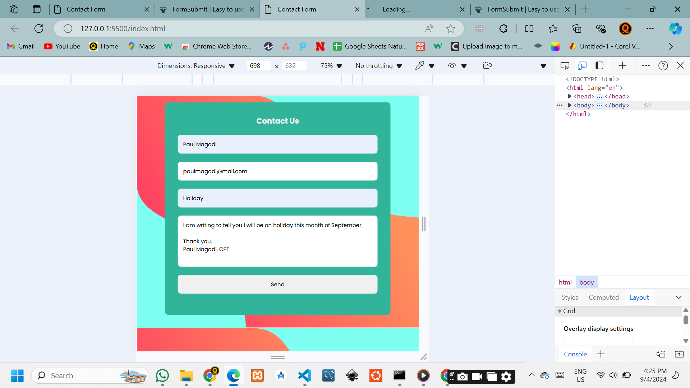
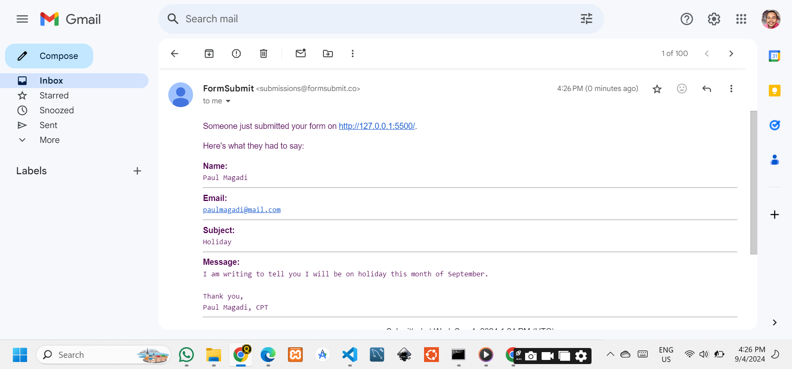
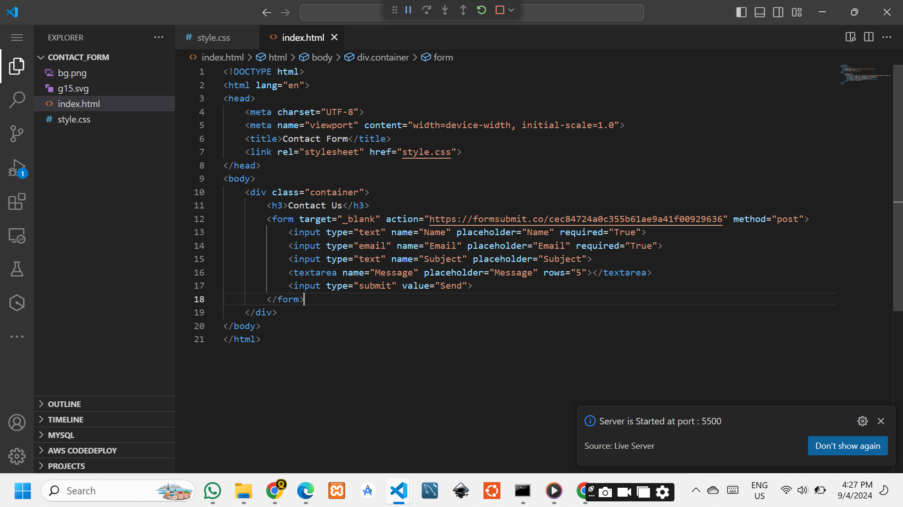

# How to Send Messages to Email Using FormSubmit with an HTML Contact Form

In this video, I'll show you how to easily send messages from an HTML contact form directly to your email using FormSubmit (https://formsubmit.co/). This quick and simple method requires no backend code or complex setup. Perfect for beginners or anyone looking to add an email feature to their website fast.

### 🔹 What You'll Learn:

- Setting up an HTML contact form.
- Configuring FormSubmit to receive email submissions.
- Testing the form to ensure emails are being sent successfully.

Whether you're building a portfolio website, a business page, or any project that requires user feedback via email, this tutorial will help you integrate the contact form functionality in just a few minutes.

🔹 Key Links:

FormSubmit website: https://formsubmit.co

[FormSubmit](https://formsubmit.co)

### Images

